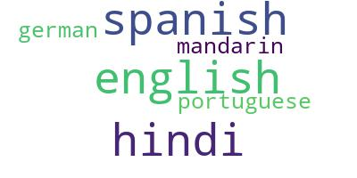

# Wordcloud API
A simple wordcloud API based on [amueller/word_cloud](https://github.com/amueller/word_cloud).


## ☁️ What

Wordcloud API is a simple, customizable wordcloud generation API that doesn't require Internet access, can be self-hosted and returns a word cloud.

## 💡 Why

- Looking for a simple API that could return customized wordcloud images didn't turn out well.
- [Quickchart](https://github.com/typpo/quickchart) doesn't have wordcloud within their open-sourced codebase. My use case involved hosting an API within a self-contained, isolated (no Internet access) environment.
- Community version of Quickchart APIs is restricted by a [rate-limit](https://quickchart.io/pricing/) of 1 wordcloud per sec per IP address. Also, I didn't want to pay for unlimited hits. Solution: Build my own API ;).

## 🚀 Usage

### Docker
The docker image [rohanlekhwani/wordcloud-api](https://hub.docker.com/r/rohanlekhwani/wordcloud-api) has all the dependencies installed and can be pulled and set to run instantly.

```
docker pull rohanlekhwani/wordcloud-api
```
In case, you need to change parameters to the wordcloud class and build a new image on-premise, a Dockerfile has been provided.

Run

```
docker run -p 8000:8000 rohanlekhwani/wordcloud-api
```

The wordcloud can be generated by making a GET request to the `/wordcloud` endpoint with wordlist within the `text` parameter.

```
http://localhost:8000/wordcloud?text="english hindi spanish portuguese german mandarin"
```

This would return the wordcloud JPEG image.



### Public Internet
In case, you don't want to host it on-premise, I have a hosted version at the following URL

```
https://rohanlekhwani.pythonanywhere.com/wordcloud
```

This API endpoint [theoretically](https://www.pythonanywhere.com/forums/topic/12632/) does not have any rate limits (Yay!) unlike Quickchart APIs. Feel free to use it in your projects. 

## 🤝 Contributing

Currently, customizations only for the word list has been provided. I've hardcoded other customizations according to my use case.

A major scope of improvement is to make use of all [parameters](https://amueller.github.io/word_cloud/generated/wordcloud.WordCloud.html) of the Wordcloud class within the API endpoint. For example, the current `min_font_size` is hardcoded to 2. This can be accepted as a parameter within the API endpoint.

```
http://localhost:8000/wordcloud?text="english hindi spanish portuguese german mandarin"&min_font_size=10
```

Accepting feature requests and bugs on the [issues](https://github.com/RonLek/wordcloud-api/issues) page.

## 🌟 Show your support
Please star this repository if this project helped you!
